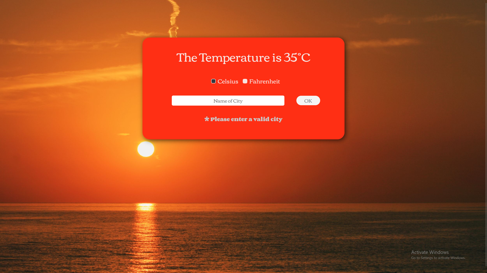
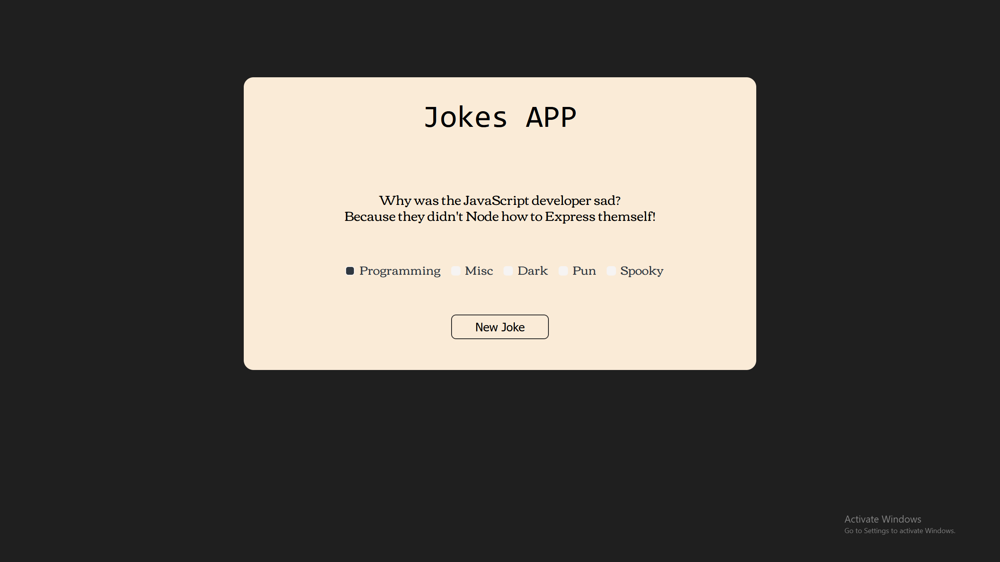

#### You found my GitHub. 👀 
<h1>Mahd Siddiqui</h1>
🖥️ Learning Full-stack Development
   

   HTML
  |  CSS
  |  JavaScript
  |  C Language
  |  C Sharp
  |  MySQL
  |  Node.js
  |  Express.js

<h2>About Me</h2>
I'm an aspiring <strong>Software Engineer</strong>, constantly learning new languages, frameworks, and building cool, real-world projects. I enjoy <strong>solving problems, experimenting with new technologies, and turning ideas into reality through code.</strong>
 
<h3>Info</h3>
	<ul>
		<li>🔭 I’m currently working on Websites and Full-Stack applications</li>
		<li>🌱 I’m currently learning Full Stack development</li>
		<li>👯 I’m looking to collaborate on Web development Projects</li>
		<li>📫 How to reach me: </li>
		<ul>
			<li>  : <a href=""> mahd.r.siddiqui@gmail.com</a>, </li>
			<li> : <a href="">javajonesyxd</a> </li>
		</ul>
		<li>⚡ Fun fact: I love playing games like Apex, Minecraft, etc.</li>
	</ul>

<h3>Languages & Tools</h3>
<ul>
        <li>🧱 Advanced Knowledge in <strong>HTML/CSS</strong></li>
        <li>⚡ Intermediate Knowledge in <strong>JS</strong>and frameworks <strong>(Node/Express)</strong></li>
		<li>🔗 Fundamental Knowledge in <strong>API Integration</strong></li>
        <li>🗄️ Fundamental Knowledge in <strong>MySQ</strong>L</li>
        <li>⚙️ Basic Knowledge in <strong>C</strong> & <strong>C#</strong></li>
</ul>

<h2>My Projects</h2>
I have made <strong>many</strong> Web Applications, such as these:

<h3 align="left">Interactive Weather Application:</h3>

<h4>https://www.weather-app-ltl5.vercel.app</h4>
 
<h3>Joke Generator Application:</h3>

<h4>https://www.weather-app-ltl5.vercel.app</h4>
 

##### more in my repositories

